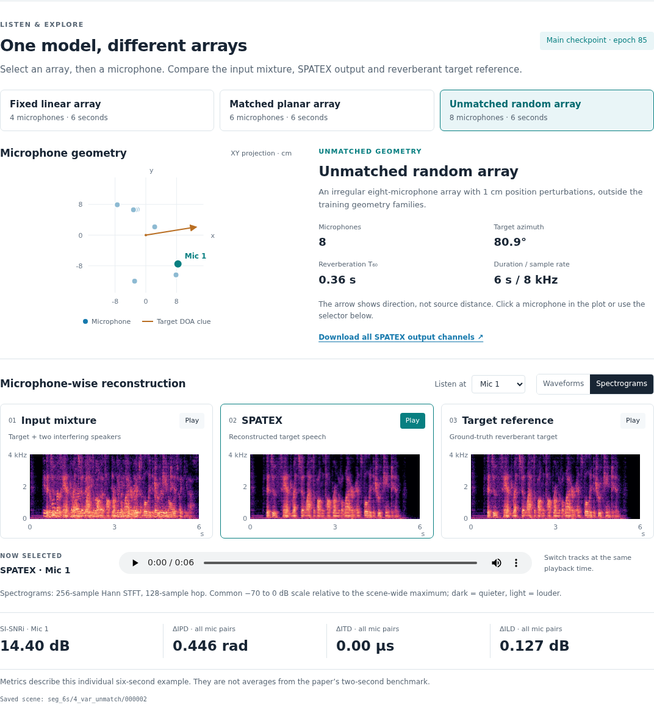

# SPATEX

## Introduction

Official PyTorch implementation of **SPATEX: Array-Flexible
Multichannel-to-Multichannel Target Speech Extraction Using Direction Clue**.

**Submitted to ICASSP 2027.**

**Wen Wen\*, Changda Chen\*, Yu Xi, Haoyu Li, Qiang Zhou, Guanyu Chen,
Xiaoyu Gu, Bohan Li, Shuai Wang, and Kai Yu†**

\* Equal contribution. † Corresponding author.

[Code](https://github.com/Wenanzhi/SPATEX) | [Demo](https://wenanzhi.github.io/SPATEX/demo/) | [Pretrained model](#pretrained-model)

SPATEX reconstructs the target speech image at every microphone using the
microphone coordinates and a target direction-of-arrival clue. Geometry-aware
channel exchange and shared temporal attention coordinate microphone-specific
streams, while IPD and coherence supervision preserve interchannel relationships.
A single model is trained with 2–8 microphones at 8 kHz; the paper also evaluates
microphone-count extrapolation and robustness to direction-clue errors.

## Network architecture


Encoder and decoder weights are shared across microphones. Temporal co-attention
averages attention logits over valid microphones and applies the shared attention
map to each microphone's own value features. Masked geometry-aware TAC supports
variable channel counts and permutation-equivariant processing.

<details>
<summary>Results reported in the paper</summary>

Reference-channel SI-SNR improvement reported in **Table 2 of the paper**:

| Test condition | Microphones | SPATEX SI-SNRi (dB) ↑ |
|---|---:|---:|
| Matched geometry | 2–8 | 14.23 |
| Unmatched geometry | 2–8 | 13.82 |
| Matched geometry | 9–10 | 15.04 |
| Unmatched geometry | 9–10 | 15.98 |

Matched arrays are linear or regular planar grids. Unmatched arrays are sparse
or random, with microphone-position perturbations. The 9–10 microphone tests
extend beyond the training microphone-count range.

On the **fixed four-microphone linear array** (Table 3), the variable-array model
achieves **12.90 dB SI-SNRi**, **0.614 rad ΔIPD**, and **5.00 μs ΔITD**, without
array-specific fine-tuning.

</details>

## Audio demo

[**Open the interactive demo →**](https://wenanzhi.github.io/SPATEX/demo/)

Explore three real six-second examples generated with the released epoch-85
checkpoint: a four-microphone linear array, a six-microphone planar array, and an
eight-microphone random array. Select a microphone to compare the mixture,
SPATEX output and reverberant target, inspect waveforms or spectrograms, and
view the array geometry and per-example spatial errors.

[](https://wenanzhi.github.io/SPATEX/demo/)

For local use, open `docs/demo/index.html`, or serve the repository:

```bash
python -m http.server 8000
# Open http://localhost:8000/docs/demo/
```

Audio is precomputed from the actual checkpoint. Shared playback gain and display
scales preserve channel-level comparisons. See [demo details](docs/demo/README.md)
for the deterministic sample selection and asset-generation command.

## Quick start

### Installation

The experiment environment uses **Python 3.8.20**, **PyTorch/torchaudio 2.4.1**
and **CUDA 12.1**. Install the matching PyTorch/torchaudio build for your machine.

```bash
git clone https://github.com/Wenanzhi/SPATEX.git
cd SPATEX
python -m pip install -r requirements.txt
python -m pip install -e . --no-deps
```

`requirements.txt` includes training, room simulation, evaluation and test
dependencies. Run all commands below from the repository root.

### Pretrained model

| Model | Configuration | Weights | Epoch | Parameters |
|---|---|---|---:|---:|
| SPATEX variable-array | [Config](configs/spatex_variable.json) | [Download](https://github.com/Wenanzhi/SPATEX/raw/refs/heads/main/checkpoints/spatex_variable.pt) | 85 | 4.57 M |

The checkpoint is included in a regular Git clone. It contains the original
model tensors and the epoch label, with optimizer and training-history state
removed, and is intended for inference and evaluation. Other training recipes
are provided below; only the main epoch-85 checkpoint is distributed.

File metadata and checksums are in [checkpoints/manifest.json](checkpoints/manifest.json).
To verify the downloaded weights:

```bash
sha256sum -c checkpoints/SHA256SUMS
```

### Inference

Provide an 8-kHz multichannel WAV, microphone coordinates, and the target azimuth.
No enrollment speech is required.

```bash
python -m pact.infer \
  --config configs/spatex_variable.json \
  --checkpoint checkpoints/spatex_variable.pt \
  --mixture /path/to/mixture.wav \
  --geometry examples/geometry_fixed4.json \
  --azimuth 30 --output outputs/target.wav --device cpu
```

Use `--device cuda:0` for GPU inference. The Python package retains its earlier
name `pact`.

- Microphone coordinates are in metres and must follow the WAV channel order.
- Azimuth is measured from +y toward +x, with +z vertical.
- The example geometry is a four-microphone linear array with 4-cm spacing;
  replace it with the geometry of your recording.
- The output is a floating-point multichannel WAV containing the estimated
  target image at each microphone.

### Training

Prepare the LibriSpeech `train-clean-100`, `dev-clean`, and `test-clean` subsets
under a common directory. Training mixtures contain one target and two
interfering speakers; reverberation is generated using pyroomacoustics.

```text
/path/to/LibriSpeech/
├── train-clean-100/
├── dev-clean/
└── test-clean/
```

Prepare an experiment and train on one GPU:

```bash
python scripts/prepare_experiment.py \
  --config configs/spatex_variable.json \
  --output experiments/spatex_variable \
  --librispeech-root /path/to/LibriSpeech

python -m src.training.train experiments/spatex_variable --use_cuda --gpu_ids 0
```

For eight GPUs with a global batch size of eight:

```bash
torchrun --standalone --nproc_per_node=8 -m src.training.train \
  experiments/spatex_variable --use_cuda --find_unused_parameters
```

Available recipes:

| Configuration | Temporal attention | Spatial losses | Training arrays |
|---|---|---|---|
| `spatex_variable` | Shared | IPD + Coh | Variable, 2–8 microphones |
| `spatex_fixed4` | Shared | IPD + Coh | Fixed four-mic linear |
| `independent_full` | Independent | IPD + Coh | Variable, 2–8 microphones |
| `spatex_pcm` | Shared | None | Variable, 2–8 microphones |
| `spatex_ipd` | Shared | IPD | Variable, 2–8 microphones |
| `spatex_coherence` | Shared | Coh | Variable, 2–8 microphones |

Each configuration preserves its actual experiment settings. See the
[training and evaluation notes](docs/DATA_AND_METRICS.md#released-training-recipes)
for the auxiliary loss, epoch convention and checkpoint-selection rule.

## Evaluation

### Prepare test data

The bundled generator supports the fixed four-microphone condition and matched
and unmatched geometry with 2–8 microphones:

```bash
python -m src.training.build_testsets \
  --librispeech_root /path/to/LibriSpeech --out_root data/Testset \
  --segments 2 --num_samples 500 \
  --subsets 1_4ch_fixed 3_var_match 4_var_unmatch
```

Saved test audio and LibriSpeech recordings are not included. The commands here
cover these three bundled conditions; they do not generate the paper's separate
9–10 microphone subsets. Regenerated WAVs have not been verified to match the
original saved evaluation WAVs byte for byte. Array settings and the saved-data
format are documented in [Data and metrics](docs/DATA_AND_METRICS.md).

### Extraction quality and spatial fidelity

Prepare the experiment directory for the released checkpoint:

```bash
mkdir -p experiments/spatex_variable
cp configs/spatex_variable.json experiments/spatex_variable/config.json
cp checkpoints/spatex_variable.pt experiments/spatex_variable/85.pt

python -m src.training.run_testsets spatex_variable \
  --testset_root data/Testset --segment seg_2s \
  --subsets 1_4ch_fixed 3_var_match 4_var_unmatch \
  --checkpoint 85.pt --paper_metrics --detailed \
  --out_root outputs/metrics --detailed_out_root outputs/per_scene \
  --use_cuda --gpu_ids 0
```

This exports reference-channel SI-SNRi, SNRi, narrowband PESQ and STOI, as well as
pairwise IPD, ITD and ILD errors. Use `--checkpoint 85.pt` for the released model;
`best` requires validation history from a full training checkpoint. Omit the CUDA
options for CPU evaluation.

### Direction preservation and DOA-clue errors

```bash
python -m src.training.eval_doa_preservation spatex_variable \
  --project_root . --testset data/Testset/seg_2s/3_var_match \
  --output_root outputs/doa --label_cache outputs/labels_match.npz \
  --build_label_cache --pretrain_path 85.pt \
  --estimator srp_phat --device cpu --num_samples 500
```

This evaluates output-to-target DOA drift and Pres@5 using SRP-PHAT. For the
fixed-array clue-error experiment, use `1_4ch_fixed`, a separate label cache and
`--offsets -15 -10 -5 0 5 10 15`.

## Citation

If you use this code or checkpoint, please cite the submitted manuscript:

```bibtex
@unpublished{wen2026spatex,
  title  = {{SPATEX}: Array-Flexible Multichannel-to-Multichannel Target Speech Extraction Using Direction Clue},
  author = {Wen, Wen and Chen, Changda and Xi, Yu and Li, Haoyu and Zhou, Qiang and Chen, Guanyu and Gu, Xiaoyu and Li, Bohan and Wang, Shuai and Yu, Kai},
  year   = {2026},
  note   = {Submitted to ICASSP 2027},
  url    = {https://github.com/Wenanzhi/SPATEX}
}
```

## License and acknowledgments

The implementation builds on the M2M-TSE code family, with components originating
from [DeFTAN-II](https://github.com/donghoney0416/DeFTAN-II) and
[Waveformer](https://github.com/vb000/Waveformer). Room simulation uses
[pyroomacoustics](https://github.com/LCAV/pyroomacoustics).
See [LICENSE](LICENSE) and [third-party notices](THIRD_PARTY_NOTICES.md) for the
inherited GPL v2 license and source attribution.

For questions or issues, please use the
[GitHub issue tracker](https://github.com/Wenanzhi/SPATEX/issues).
