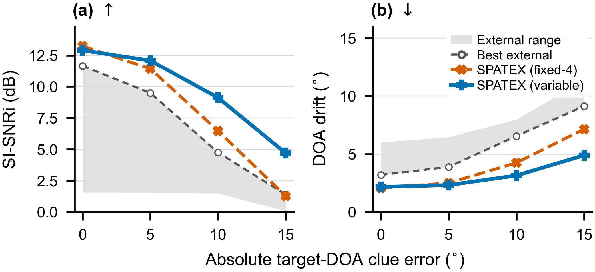

# SPATEX

**Spatial Preservation for Array-Flexible Target Speech Extraction**

[English](README.md) | [简体中文](README_zh.md)

Code accompanying the manuscript **SPATEX: Array-Flexible Multichannel-to-Multichannel
Target Speech Extraction with Spatial Cue Preservation**. SPATEX uses the mixture, microphone coordinates, a
channel-validity mask, and target azimuth to reconstruct one reverberant target
waveform per microphone. The variable-array model is trained with 2–8 microphones at 8 kHz.

SPATEX was previously named PACT. The repository name, Python package `pact`, and
configuration filenames retain their existing names for compatibility.

## Architecture

[](docs/figures/spatex_architecture.pdf)

**Figure 1. SPATEX architecture.** Geometry-aware TAC exchanges information across
microphone streams, while target-DOA conditioning guides extraction. Temporal
co-attention shares an attention map across microphones and retains each
microphone's value stream. A shared decoder reconstructs the reverberant target
image at each microphone. [Vector PDF](docs/figures/spatex_architecture.pdf).

## Release status

**Release candidate for author review.** The archived training configs include
`0.1 * activity_loss`, whereas the supplied manuscript specifies
`PCM + 0.15 * IPD + 0.03 * coherence`. This package exposes both configurations;
see [reproduction status](docs/REPRODUCIBILITY.md). No pretrained weights or
speech recordings are distributed in this candidate.

## Installation

The experiment environment used Python 3.8.20, PyTorch/torchaudio 2.4.1 and CUDA
12.1. CPU code checks use that environment. A clean installation and other
Python/PyTorch versions have not yet been validated.

```bash
python -m pip install -r requirements.txt
python -m pip install -e . --no-deps
# For online reverberant mixture generation:
python -m pip install -r requirements-data.txt
# For NB-PESQ / STOI evaluation and tests:
python -m pip install -r requirements-dev.txt
```

Install a matching PyTorch/torchaudio CPU or CUDA build for your machine before
running the commands above. Run the following examples from the repository root.

## Inference

Place an author-provided checkpoint in `checkpoints/` and use its matching config.
Input WAV channels and the `mic_xyz` rows must have the same order. Coordinates
are in metres; azimuth is measured from +y toward +x, with +z vertical. The
original clue encoder rounds azimuth to integer degrees and uses a 40-dimensional
cyclic encoding. Enrollment speech is not needed for `doa_only` inference.

```bash
python -m pact.infer \
  --config configs/archived/pact_full.json \
  --checkpoint checkpoints/pact_full.pt \
  --mixture examples/mixture.wav \
  --geometry examples/geometry_fixed4.json \
  --azimuth 30 --output outputs/target.wav --device cpu
```

`examples/mixture.wav` and the checkpoint are user-supplied. Output uses floating
point WAV to preserve channel amplitudes. The example geometry is a four-mic
linear array with 4 cm spacing. For Python use:

```python
from pact import load_model, extract

model = load_model("configs/archived/pact_full.json", "checkpoints/pact_full.pt")
# mixture: [batch, microphones, samples], mic_xyz: [batch, microphones, 3]
# mic_mask: [batch, microphones], 1 = valid, 0 = padding
target = extract(model, mixture, mic_xyz, azimuth_deg=30.0, mic_mask=mic_mask)
```

## Train

Prepare the original LibriSpeech layout with `train-clean-100`, `dev-clean`, and
`test-clean` under one directory. Choose an objective explicitly:

- `configs/archived/`: preserves the loss switches stored with the experiments.
- `configs/manuscript/`: sets `act_loss_weight=0`; these are fresh training recipes,
  not evidence that the existing weights used the manuscript's three-term loss.

```bash
python scripts/prepare_experiment.py \
  --config configs/manuscript/pact_full.json \
  --output experiments/pact_full \
  --librispeech-root /path/to/LibriSpeech

python -m src.training.train experiments/pact_full --use_cuda --gpu_ids 0
```

For the original global batch size of eight across eight GPUs:

```bash
torchrun --standalone --nproc_per_node=8 -m src.training.train \
  experiments/pact_full --use_cuda --find_unused_parameters
```

The activity branch's parameter names are retained for checkpoint compatibility;
`--find_unused_parameters` is needed when training configurations leave parameters
unused. The trainer uses global batch size 8, Adam, learning rate 0.0005, clipping
at 0.5, and validation SI-SNRi checkpoint selection. See the reproduction notes
for the historical epoch-loop and random-protocol details.

## Build and evaluate test sets

```bash
python -m src.training.build_testsets \
  --librispeech_root /path/to/LibriSpeech --out_root data/Testset \
  --segments 2 --num_samples 500 \
  --subsets 1_4ch_fixed 3_var_match 4_var_unmatch

python -m src.training.run_testsets pact_full \
  --testset_root data/Testset --segment seg_2s \
  --subsets 1_4ch_fixed 3_var_match 4_var_unmatch \
  --checkpoint best --paper_metrics --detailed \
  --out_root outputs/metrics --detailed_out_root outputs/per_scene \
  --use_cuda --gpu_ids 0
```

Use a populated `experiments/pact_full/config.json` and the corresponding
integer-named checkpoints. `--checkpoint 85.pt` selects an explicit checkpoint
instead of looking up the validation best. The paper's signal scores use
`reference_*` columns, not the average across microphone outputs.

The generator creates deterministic local test sets. Published scores were
computed on existing saved WAV files; new generation has not been verified to
recreate those files byte for byte. See [data and metrics](docs/DATA_AND_METRICS.md)
for SRP-PHAT direction preservation and signed DOA perturbation evaluation.

## Experiments

| Config name | Purpose | Archived checkpoint |
|---|---|---|
| `pact_full` | SPATEX, shared mean logits, IPD + Coh | 85.pt |
| `independent_full` | Independent temporal attention, same TAC and spatial losses | 84.pt |
| `pact_pcm` | Shared attention, spatial losses disabled | 99.pt |
| `pact_ipd` | Shared attention, IPD | 89.pt |
| `pact_coherence` | Shared attention, Coh | 99.pt |
| `pact_fixed4` | Fixed four-mic SPATEX | 97.pt |
| `pact_no_geometry` | Unstable no-geometry diagnostic | No reported score |

All six scored archived configs have activity-loss weight 0.1. The earlier
`sqrt_count` model is a historical comparison, not the final SPATEX configuration.
The exact experiment names and source config hashes are in
[experiment_index.json](docs/experiment_index.json).

### Robustness to target-DOA cue errors

[](docs/figures/spatex_doa_robustness.pdf)

**Figure 2. Robustness under the fixed four-microphone linear-array condition.**
Results at positive and negative offsets of equal magnitude are averaged over
the same 500 scenes. The shaded region spans the four external baselines, and
the dashed gray curve shows the best external result at each error magnitude.
Panels show SI-SNRi (higher is better) and output–target DOA drift (lower is better).
[Vector PDF](docs/figures/spatex_doa_robustness.pdf) ·
[Signed-offset results](results/figure2_signed.csv).

## Repository map

- `pact/`: public inference API and WAV command.
- `src/training/`: SPATEX backbone, losses, data, training and evaluation.
- `configs/`: portable archived and manuscript-aligned recipes.
- `data_protocol/`: sanitized configurations of the three saved test conditions.
- `results/`: archived metrics and their source ledger; no new training results.
- `tests/`: numerical, masking, data reproducibility and I/O regression checks.
- `docs/`: protocol, provenance, differences and baseline coverage.

Run `python -m pytest -q`. Legacy internal class names and optional experimental
branches remain to preserve existing checkpoints; only the listed configs are
part of this release candidate.

## Attribution and license

This candidate retains the GPL v2 license shipped with the M2M-TSE source used
by this project. See [LICENSE](LICENSE) and [third-party notices](THIRD_PARTY_NOTICES.md).
The manuscript is a draft; no DOI, proceedings entry or publication URL is
invented. Citation metadata is provided in [CITATION.cff](CITATION.cff).
