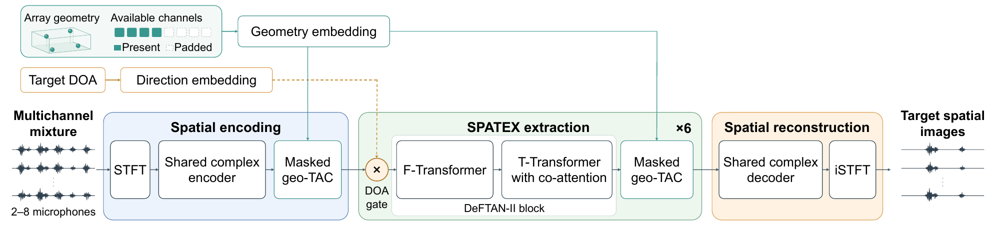

# SPATEX

**Spatial Preservation for Array-Flexible Target Speech Extraction**

[English](README.md) | [简体中文](README_zh.md)

本仓库提供 SPATEX 的训练、推理、测试代码，以及主模型 epoch 85 的权重。
模型输入多通道混合语音、麦克风坐标和目标方位角，输出每个麦克风上的混响目标语音。
主模型使用 8 kHz 音频及 2–8 麦克风阵列训练。



## 安装

实验环境：Python 3.8.20、PyTorch/torchaudio 2.4.1、CUDA 12.1。
先安装适合本机的 PyTorch/torchaudio，再执行：

```bash
python -m pip install -r requirements.txt
python -m pip install -e . --no-deps
python -m pip install -r requirements-data.txt  # 在线混响生成和测试集生成
python -m pip install -r requirements-eval.txt  # PESQ、STOI
```

以下命令均在仓库根目录执行。

## 主模型权重

| 模型 | 配置 | 权重 | 原始 epoch 标签 | 参数量 |
|---|---|---|---:|---:|
| SPATEX variable-array | [配置](configs/spatex_variable.json) | [下载](https://github.com/Wenanzhi/SPATEX/raw/refs/heads/main/checkpoints/spatex_variable.pt) | 85 | 4,567,660 |

普通 `git clone` 即包含权重，无需 Git LFS。权重逐张量保留原始 `85.pt` 的模型参数，
移除了优化器、调度器、AMP 状态和指标历史，适用于推理及测试。
精确断点续训需要原始完整训练 checkpoint。

```bash
sha256sum -c checkpoints/SHA256SUMS
```

文件大小和校验值见 [manifest](checkpoints/manifest.json)。Python 包沿用旧名称 `pact`。

## 推理

```bash
python -m pact.infer \
  --config configs/spatex_variable.json \
  --checkpoint checkpoints/spatex_variable.pt \
  --mixture /path/to/mixture.wav \
  --geometry examples/geometry_fixed4.json \
  --azimuth 30 --output outputs/target.wav --device cpu
```

输入须为 8 kHz。麦克风坐标单位为米，坐标行顺序须与 WAV 通道顺序一致。
方位角从 +y 朝 +x 方向计算，+z 向上。示例坐标是间距 4 cm 的四麦线阵，
使用时请替换成实际阵列坐标。推理无需注册语音，输出为浮点 WAV。

## 训练

将 LibriSpeech 的 `train-clean-100`、`dev-clean`、`test-clean` 放在同一目录：

```bash
python scripts/prepare_experiment.py \
  --config configs/spatex_variable.json \
  --output experiments/spatex_variable \
  --librispeech-root /path/to/LibriSpeech

python -m src.training.train experiments/spatex_variable --use_cuda --gpu_ids 0
```

八卡、全局 batch size 为 8 的命令：

```bash
torchrun --standalone --nproc_per_node=8 -m src.training.train \
  experiments/spatex_variable --use_cuda --find_unused_parameters
```

主模型损失为 PCM + 0.15 IPD + 0.03 Coh + 0.1 Act；配置保留实际训练设置。
使用 Adam，初始学习率 0.0005，梯度裁剪 0.5。原训练器的 `epochs=100` 对应
0–100 的 epoch 标签。最优 checkpoint 根据有效输出通道平均验证 SI-SNRi 选择。

`configs/` 同时保留 fixed-4、Independent、PCM、IPD、Coh 五种训练配置，
这些配置也保留 Act 辅助损失；本次只发布主模型 epoch 85 的权重。

## 测试

生成测试集：

```bash
python -m src.training.build_testsets \
  --librispeech_root /path/to/LibriSpeech --out_root data/Testset \
  --segments 2 --num_samples 500 \
  --subsets 1_4ch_fixed 3_var_match 4_var_unmatch
```

准备实验目录并测试已保存的 WAV：

```bash
mkdir -p experiments/spatex_variable
cp configs/spatex_variable.json experiments/spatex_variable/config.json
cp checkpoints/spatex_variable.pt experiments/spatex_variable/85.pt

python -m src.training.run_testsets spatex_variable \
  --testset_root data/Testset --segment seg_2s \
  --subsets 1_4ch_fixed 3_var_match 4_var_unmatch \
  --checkpoint 85.pt --paper_metrics --detailed \
  --out_root outputs/metrics --detailed_out_root outputs/per_scene \
  --use_cuda --gpu_ids 0
```

发布权重请显式指定 `85.pt`；`best` 选项需要完整训练 checkpoint 的验证历史。
删除 CUDA 选项即可使用 CPU。DOA preservation 测试：

```bash
python -m src.training.eval_doa_preservation spatex_variable \
  --project_root . --testset data/Testset/seg_2s/3_var_match \
  --output_root outputs/doa --label_cache outputs/labels_match.npz \
  --build_label_cache --pretrain_path 85.pt \
  --estimator srp_phat --device cpu --num_samples 500
```

DOA 误差实验改用 `1_4ch_fixed`、独立的 label cache，并添加
`--offsets -15 -10 -5 0 5 10 15`。阵列定义与指标口径见
[数据和评测说明](docs/DATA_AND_METRICS.md)。语音录音和已保存测试 WAV 不随仓库发布；
重新生成的 WAV 尚未验证与原测试集逐字节相同。

## 基本检查与许可证

```bash
python -m pip install -r requirements-dev.txt
python -m pytest -q
```

保留权重加载、前向/损失/指标、麦克风掩码和置换等基本检查。
许可证及来源说明见 [LICENSE](LICENSE)、[第三方声明](THIRD_PARTY_NOTICES.md)，
引用信息见 [CITATION.cff](CITATION.cff)。
